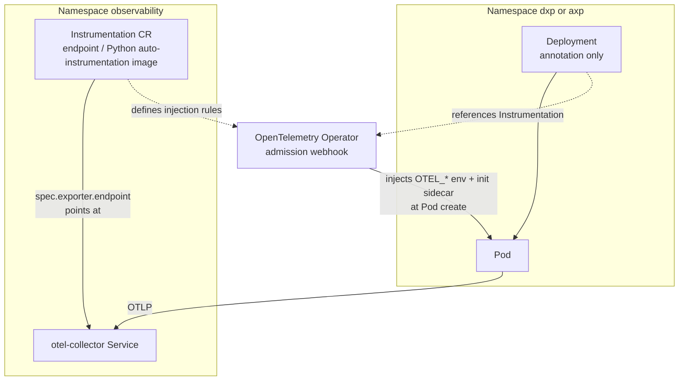

# Multiple namespaces and instrumentation YAML

This doc focuses on **instrumentation manifests** (what you declare once) versus **application Deployments** (what only references instrumentation). General collector + NetworkPolicy flow stays in `otel-architecture.md`.

---

## Relationship (who owns what)



| Object | Namespace (example) | Role |
|--------|---------------------|------|
| **`Instrumentation`** | `observability` | Single YAML that sets **exporter endpoint**, propagators, and **Python auto-instrumentation** image. This is the “instrumentation code” you maintain centrally—not repeated per app. |
| **`Deployment`** | `dxp` | References instrumentation via **annotation** only. **No** `OTEL_EXPORTER_OTLP_*` block in the container env when injection is enabled. |
| **`otel-collector`** | `observability` | Receives OTLP. The **Instrumentation** `spec.exporter.endpoint` must resolve to this Service (cluster DNS). |
| **NetworkPolicy** | collector namespace | Still controls **which app namespaces** may open TCP to OTLP; injection does not replace that gate. |

---

## Instrumentation YAML (central, one place)

Example using the **OpenTelemetry Operator** `Instrumentation` CR (API shape varies slightly by operator version; adjust `apiVersion` to match your cluster). This manifest lives with the **platform** (often the same namespace as the collector).

```yaml
apiVersion: opentelemetry.io/v1alpha1
kind: Instrumentation
metadata:
  name: python
  namespace: observability
spec:
  exporter:
    endpoint: http://otel-collector.observability.svc.cluster.local:4317
  propagators:
    - tracecontext
    - baggage
  python:
    image: ghcr.io/open-telemetry/opentelemetry-operator/autoinstrumentation-python:latest
```

**Relationship:** `spec.exporter.endpoint` is the **only** place you pin “where OTLP goes” for every Python workload that opts in. Change the collector URL here instead of editing each app Deployment.

---

## Application Deployment YAML (reference only, no exporter env)

When injection is enabled, the app Deployment **does not** embed exporter configuration. It **points** at the `Instrumentation` object (namespace/name).

```yaml
apiVersion: apps/v1
kind: Deployment
metadata:
  name: my-app
  namespace: dxp
spec:
  template:
    metadata:
      annotations:
        instrumentation.opentelemetry.io/inject-python: "observability/python"
    spec:
      containers:
        - name: app
          image: my-app:1.0
          # No OTEL_EXPORTER_OTLP_ENDPOINT here — operator injects env at Pod admission.
```

**Relationship:** `inject-python: "observability/python"` means “use the `Instrumentation` named `python` in namespace `observability`.” The webhook merges the exporter env and auto-instrumentation **into the Pod spec** at create time.

---

## Contrast: manual exporter env (no operator injection)

If you **do not** use an `Instrumentation` CR, each Deployment carries exporter settings explicitly (this repo’s Helm sample does this for clarity):

```yaml
env:
  - name: OTEL_EXPORTER_OTLP_ENDPOINT
    value: "http://otel-collector.observability.svc.cluster.local:4317"
  - name: OTEL_EXPORTER_OTLP_PROTOCOL
    value: grpc
```

**Relationship:** Same logical link (app → collector DNS), but **every** service duplicates YAML; there is no shared `Instrumentation` object.

---

## Multiple namespaces only (layout)

Keeping the **collector** and **`Instrumentation`** in **one namespace** (for example `observability`) and applications in **other** namespaces (for example `dxp`, `axp`) keeps RBAC and NetworkPolicy simple: approve **namespaces**, not every Pod template.

| Benefit | Why it matters |
|---------|----------------|
| **Isolation** | Platform owns `observability`; teams own app namespaces. |
| **Approval-style gating** | NetworkPolicy allows only labeled or listed namespaces to reach OTLP on the collector (`kubernetes/otel-collector/networkpolicy-ingress-approved-namespaces.yaml`). |
| **Clear DNS** | `Instrumentation.spec.exporter.endpoint` uses the collector Service FQDN inside the cluster. |

---

## Summary

- **Instrumentation YAML** (`Instrumentation` CR) = centralized OTLP target and auto-instrumentation image; **one** object to update when the collector moves or TLS changes.
- **Application YAML** = optional **annotation** only; **relationship** is **reference** (`namespace/name`), not copy-paste exporter env.
- **Collector + NetworkPolicy** = still the **connection** gate between namespaces; see `otel-architecture.md` for approval vs tag-only behavior.
