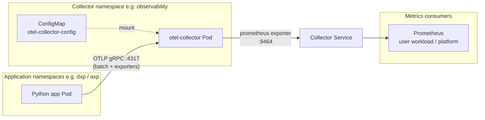
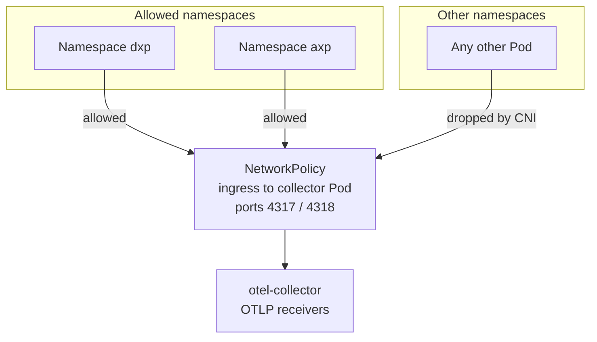
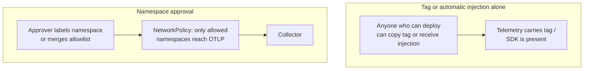
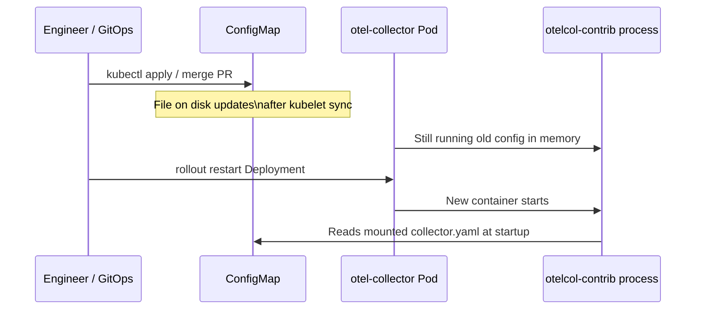

# OpenTelemetry on Kubernetes / OpenShift

This document summarizes how the pieces in this repository fit together: the Python sample app, the OpenTelemetry Collector, and namespace gating with NetworkPolicy.

For **multiple namespaces** as a layout choice and **instrumentation injection** (fewer manual exporter env blocks in Deployments), see **`multi-namespace-instrumentation.md`**.

## Repository layout

| Path | Purpose |
|------|--------|
| `kubernetes/otel-collector/` | Collector `ConfigMap`, `Deployment`, `Service`, optional `NetworkPolicy` |
| `helm/python-otel-app/` | Helm chart for the Python app (OTLP to the collector) |
| `apps/python-metrics/` | Sample Python app (OTLP metrics; optional in-process `/metrics` for local use) |
| `docs/multi-namespace-instrumentation.md` | Namespaces-only layout vs collector; injection vs manual OTLP env in YAML |

---

## End-to-end data flow

Telemetry leaves the app over **OTLP** to the collector. The collector exposes a **Prometheus** scrape endpoint for metrics that were received and processed in the metrics pipeline.

---

## Namespace approval gate (NetworkPolicy)

Which namespaces may **open TCP connections** to the collector’s OTLP ports is enforced by **Kubernetes NetworkPolicy**, not by resource attributes inside OTLP payloads.

The sample policy allows only namespaces whose **name** is in the allowlist (for example `dxp` and `axp`). Expand the list under `matchExpressions … values`, or switch to a **shared label** on namespaces (for example `telemetry.platform/approved=true`) so new projects are approved with `kubectl label namespace …` without editing the collector.

---

## Automatic / tag-level injection vs namespace approval

**Automatic injection** (for example an operator or admission controller that injects OpenTelemetry env vars into every Pod, or a mesh that auto-exports traces) is convenient, but by itself it does **not** implement **approval**. Any workload that gets scheduled and receives the injection can send telemetry toward the collector if it can reach the OTLP endpoint. There is no separate “this project was approved” step in the data path—only “this Pod exists.”

**Tag-level injection** means attributes or labels are applied at deploy time (`OTEL_RESOURCE_ATTRIBUTES`, golden-style tags, or collector filters that trust those keys). That is still **self-assertion**: whoever can deploy a manifest can set the same tag. Tags classify telemetry; they do **not** prove that a governance process approved that tenant.

**Namespace approval with NetworkPolicy** ties **reachability** to **cluster identity**: only Pods in namespaces you explicitly allow (by name or by an approval label on the `Namespace` object) can open connections to OTLP ports. Granting access is an **explicit cluster operation** (label the namespace, merge GitOps, RBAC-gated `kubectl`). Unapproved namespaces are blocked by the **CNI**, not by trusting whatever string appears in OTLP.

| Aspect | Automatic / tag injection | Namespace approval (NetworkPolicy) |
|--------|-------------------------|-------------------------------------|
| What it controls | What metadata or SDK settings a Pod **claims** | Which Pods may **connect** to the collector |
| Approval semantics | Weak: deploy-time attribute anyone can copy | Stronger: cluster-level allowlist or labeled namespace |
| Typical misuse | Another project spoofs the tag or gets auto-injected like everyone else | Other namespaces cannot reach OTLP ports unless policy allows |
| Fits “approved projects only” | Only if combined with auth, mesh policy, or separate onboarding | Yes as the **network** gate; pair with RBAC/GitOps for who may label namespaces |

Use **tags or filters** for taxonomy inside trusted traffic; use **NetworkPolicy + namespace governance** when you need an **approval-shaped** boundary at the collector edge.

---

## Collector configuration lifecycle

The collector reads **`collector.yaml`** from a **ConfigMap** mounted as files at startup. Updating the ConfigMap alone does **not** restart Pods; you typically **roll the Deployment** after changing config.

Optional automation (for example **Reloader**, **Flux**, **Argo CD**) can trigger a rollout when the ConfigMap hash changes.

---

## Collector configuration storage

Collector runtime configuration for this repo lives in a **ConfigMap** (`kubernetes/otel-collector/configmap.yaml`): receivers, processors, exporters, and pipelines. Mount it read-only into the collector Pod; change it with Git / `kubectl apply` and roll the Deployment.

---

## Dynamic “new namespace” onboarding

| Approach | What you change | Collector restart? |
|---------|-------------------|---------------------|
| **NetworkPolicy + label on namespace** | `kubectl label namespace newproj telemetry.platform/approved=true` (if policy matches that label) | No |
| **NetworkPolicy + fixed name list** | Edit YAML `values` list, re-apply policy | No (not the collector; only NP update) |
| **Edit collector `ConfigMap`** | Git / `kubectl apply` | Usually **yes** (rollout) unless you use hot-reload tooling |

Prefer **NetworkPolicy + namespace label** for approval-style onboarding without touching collector config.

---

## Helm chart notes

The chart under `helm/python-otel-app/` renders a `Deployment` for the sample app. Point OTLP at your collector Service DNS in `templates/deployment.yaml` if the collector runs in another namespace or project.

---

## OpenShift

Collector and app `Deployment` examples use pod and container `securityContext` suited to **restricted-v2**-style SCCs. NetworkPolicy behavior requires a CNI that enforces policies (for example **OVN-Kubernetes**).
